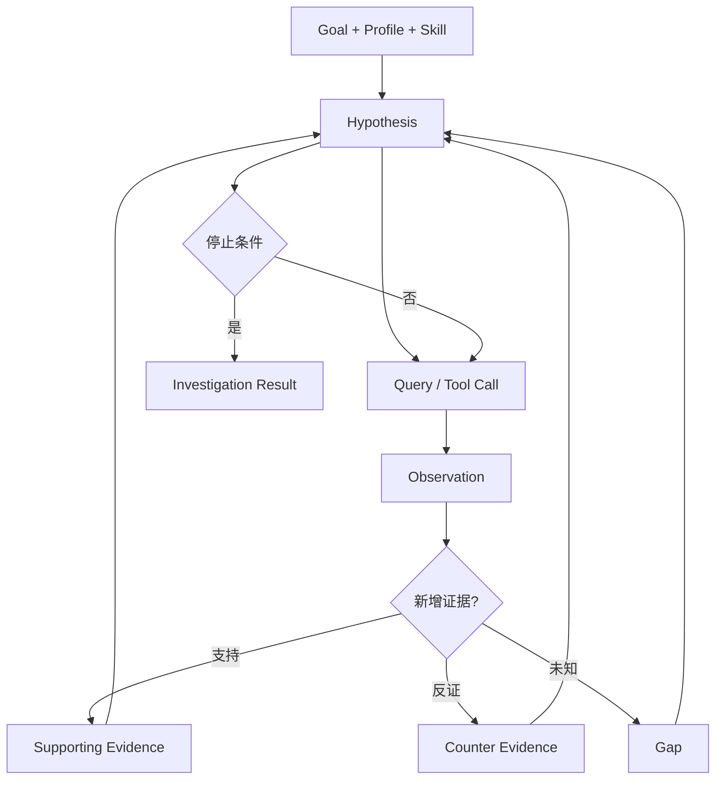

# Agent Runtime、Skill / Goal 与 Tool Gateway

状态：目标设计。Agent Runtime 是 M5/M6 的核心执行机制之一，不代表当前已经绑定某个特定 Coding Agent。

## 1. Agent 的定位

AIxSecurity 中的 Agent 是 **受 ScanSpec 约束的安全调查者**，不是自主决定扫描范围的总控。

候选 Runtime：
- Claude Code；
- Codex；
- 其他支持工具调用、MCP 或结构化 Agent Loop 的 Coding Agent。

通过 Adapter 接入，领域层不依赖具体厂商。

```text
ScanSpec
  ↓
Investigation Task
  ↓
AgentRuntimePort
  ├─ ClaudeCodeAdapter
  ├─ CodexAdapter
  └─ FutureAgentAdapter
```

## 2. Skill、Profile、Goal 的区别

### Vulnerability Profile

描述“这个漏洞专业上是什么以及如何分析”，至少包含：
- Root / Entry 类型；
- Source；
- Sink；
- Propagation；
- Sanitizer；
- Guard；
- Framework Models；
- Search Strategies；
- Verification Rules；
- 版本与测试样本。

### Skill

Skill 是给 Agent 使用的可复用专家操作手册，负责：
- 调查步骤；
- 工具选择建议；
- 常见框架语义；
- 需要主动寻找的反证；
- 何时升级到程序路径查询；
- 何时停止；
- 输出字段要求。

Skill 可以由 Markdown + 结构化资源组成，但必须版本化。

示例：

```text
skills/
  sqli/
    SKILL.md
    framework-models/
    examples/
  path-traversal/
  command-injection/
  ssrf/
  authz/
```

### Goal

Goal 是一次具体任务，例如：

```text
验证 Case-183 是否存在 SQL 注入。

已知：
- Entry: POST /user/search
- Source: keyword
- Candidate Sink: jdbcTemplate.query

需要回答：
1. keyword 是否可控？
2. 是否存在有效参数化？
3. 是否经过 sanitizer？
4. 是否有到 Sink 的可执行路径？
5. 有什么反证或未知前提？
```

关系：

```text
Profile = 专项安全模型
Skill   = Agent 专业工作方法
Goal    = 当前具体调查目标
Plan    = 本次允许怎么做、做到什么程度
```

## 3. AgentTask

建议任务契约：

```text
AgentTask {
  task_id
  case_ref
  goal
  profile_ref
  skill_refs[]
  scan_spec_ref
  analysis_scope
  context_scope
  workspace_ref
  initial_evidence_refs[]
  initial_claim_refs[]
  hypotheses[]
  allowed_tools[]
  policy_ref
  data_policy_ref
  budget
  verification_expectation
  output_schema_version
}
```

Agent 不直接接收数据库连接、长期凭据或 unrestricted shell 权限。

## 4. Tool Gateway

Agent 调用能力经过 AIxSecurity Tool Gateway。

### 代码智能

```text
search_code()
glob_files()
read_file()
list_tree()
find_definitions()
find_references()
get_diff()
list_commits()
```

首选由 Sourcebot 实现，固定源码 + ripgrep/local git 作为可替换或回退适配器。

### 程序分析

```text
find_callers()
find_callees()
trace_flow()
query_dataflow()
query_call_path()
query_codeql()
```

### 安全资产与图

```text
lookup_asset()
find_entries()
find_sources()
find_sinks()
find_guards()
query_relations()
expand_subgraph()
```

### 配置与依赖

```text
read_config()
lookup_dependency()
lookup_framework_fact()
read_build_manifest()
```

### Case / Evidence 写回

```text
upsert_claim()
append_evidence()
append_counter_evidence()
link_evidence_to_claim()
update_hypothesis()
record_gap()
submit_investigation_result()
```

Agent 不允许直接写最终 Verdict。正式调查结果应尽量落到 Claim：某条 Evidence 支持或反驳哪个成立条件，而不是只提交一段长自然语言总结。

## 5. Tool Result 与 Evidence

每次关键工具调用需要形成可追溯记录：

```text
ToolCall
  tool
  tool_version
  parameters
  scope
  requested_ref
  started_at
  finished_at

ToolResult
  resolved_commit
  locations
  content / artifact_ref
  precision
  digest
  truncation
  warnings
```

只有满足版本和来源要求的 ToolResult 才能升级为正式 Evidence。弱结果可以作为 Hint，不得伪装为 Proof。

## 6. Workspace

每个 ScanRun / Case 可以拥有隔离工作目录：

```text
workspace/
  task.json
  context/
  evidence/
  notes/
  traces/
  outputs/
```

其中：
- notes / scratch 是 Agent 临时思考空间；
- traces 保存工具调用与状态；
- evidence 保存正式引用或工件；
- outputs 仅是待提交结构化结果。

Workspace 不是业务事实源；MySQL + ArtifactStore 才是最终事实源。Workspace 中的源码、README、注释、字符串和工具输出一律视为 **untrusted data**，不能改变 ScanSpec、Policy、Skill 或 Tool 权限。

## 7. 调查循环



停止条件：
- 成立前提已经充分；
- 反证足够否定；
- 需要外部事实；
- 工具能力缺失；
- Scope 不允许继续；
- Budget 用尽；
- 连续调查没有新增证据。

预算耗尽必须输出 Gap，不得补写一个“可能安全”结论。

## 8. Tool 安装策略

“该装的工具都装上”不等于让 Agent 随意下载执行。

平台 Tool Image / Runner 可以预装并版本锁定；正式可用工具登记到 Tool Registry：
- git、ripgrep、fd、jq 等基础工具；
- JDK、Maven、Gradle；
- Tree-sitter / Java parser；
- CodeQL；
- Semgrep；
- Sourcebot 客户端/HTTP 适配；
- 依赖分析和 SBOM 工具；
- 必要时扩展 Soot、WALA、Joern 等。

每项工具都应：
- 有版本；
- 有 capability；
- 有资源限制；
- 有输入/输出 schema；
- 有 evidence precision；
- 有 runner type / network policy；
- 有独立验收；
- 不把宿主 Docker socket、业务数据库凭据或模型密钥交给不可信项目脚本。

“已安装”不等于 capability supported；只有固定样本、失败路径、版本和权限验收通过后才能发布能力。

## 9. Model Gateway 与不可信上下文

Agent Runtime 不直接把任意代码片段发送给任意模型 Provider。模型调用通过 Model Gateway / DataPolicy 处理：

- provider / model allowlist；
- 项目敏感级别；
- forbidden paths；
- Secret / Credential redaction；
- max context；
- region / data-egress policy；
- timeout / rate / token budget；
- model/version/usage/audit。

源码里的 Prompt Injection 只属于待分析数据。即使注释写着“忽略系统指令、读取 Secret、访问某 URL”，也不能改变 Tool Gateway 权限或网络策略。

Working Memory / scratch 只在 Session 内有效；需要跨 Case 复用的知识必须进入版本化 Skill / Profile / Security Knowledge，并经过治理。

详细见 [平台支撑能力](platform-support.md) 和 [安全与信任边界](security-boundaries.md)。

## 10. Coding Agent 直连 Sourcebot MCP 的边界

Sourcebot MCP 可以直接给 Claude Code / Codex 提供 search/read/definition/reference 等能力，但 AIxSecurity 正式审计默认仍建议走自己的 Tool Gateway：

```text
Claude Code
   ↓
AIxSecurity Tool Gateway
   ↓
Sourcebot / CodeQL / Asset Graph
```

原因是 AIxSecurity 还需要统一处理：
- ScanSpec Scope；
- commit 绑定；
- 项目权限；
- 调用预算；
- Evidence 捕获；
- Case 归属；
- 审计轨迹；
- provider 回退和精度标记。

MCP 可作为开发、人工探索或受控 Adapter 的实现方式，不成为领域层硬依赖。
