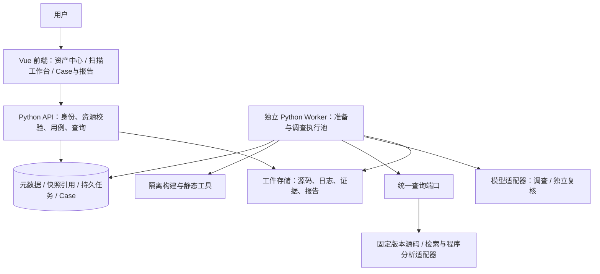

# AIxSecurity 系统架构

状态：2026-09-28 目标设计；当前代码仍为 0.8.0。**本轮仅整理文档，前端设计和代码迁移暂停。**

## 1. 结论与决策

采用 **Vue 前端 + Python API + 独立 Python Worker**，在同一个 Git 仓库中维护、分别构建与启动。
后端内部保持模块化单体与端口/适配器分层；八个业务模块不等于八个微服务，也不等于八个常驻 Agent。
产品只做安全问题发现、调查、独立复核和报告，不修改被审计代码。

| 事项 | 当前 0.8.0（事实） | 目标（尚未迁移） |
|---|---|---|
| 前端 | 原生 HTML/CSS/JS，位于 Python 包的 static 目录 | Vue + TypeScript 独立工程；构建工具建议 Vite |
| HTTP | Python ThreadingHTTPServer 同时提供静态资源和 /api | Python API 独立进程；框架建议 FastAPI，依赖版本在实施时锁定 |
| 后台任务 | serve() 启动同进程后台线程 | 独立 Worker 进程，API 重启不终止准备和审计 |
| 业务分层 | domain/application/adapters/entrypoints | 保留并补齐，不推倒重写 |
| 存储 | SQLite + 本地工件 | 首阶段保留；多实例前验证并发并评估 PostgreSQL |
| 程序分析 | Semgrep CE 单函数候选 + Java 资产观察 | 通过端口逐步接入精确程序分析与检索适配器 |
| 模型 | 有限调用、受控读码、独立上下文复核 | 正式 Case 补证循环和版本绑定复核 |

因此，现在是“代码有分层”，不是“前后端已经分离”。框架替换不改变安全分析方法，也不自动提升检出效果。

## 2. 系统组件与依赖



- 前端只经 API 获取业务数据，不读数据库、仓库文件系统或模型密钥；不直接调用扫描工具。
- API 完成资源授权、输入校验和事务入队；长任务不在请求处理器内执行。
- Worker 通过同一套应用用例和端口执行业务；准备池与调查池具有不同资源/凭据边界。
- 适配器负责工具差异，领域规则不导入 Vue、HTTP 框架、数据库或模型 SDK。
- 依赖方向：入口 → 应用 → 领域；适配器实现应用端口；composition 负责装配。
- CLI 保留，复用应用用例；不得另写一套规则或绕过发布门禁。

## 3. 八个业务模块怎么组成

| 模块 | 职责与输入 | 输出/数据所有权 | 禁止越界 |
|---|---|---|---|
| M1 资产管理 | 登记项目、仓库 URL/ref、服务与模块映射 | Project、Repository、RepoRevision、纳入请求 | 不因登记成功直接 READY |
| M2 代码处理 | 固定版本、准备配置；解析、索引、隔离构建、程序建库 | 工具产物、构建诊断、源码清单 | 构建失败不伪装成功或静默降级 |
| M3 安全资产 | 归一化接口/Source/Sink/Guard、关系、精度与缺口 | AssetSnapshot、RepositorySetSnapshot、能力与质量清单 | 检索关系不等于程序路径证明 |
| M4 扫描工作台/计划 | 人选择 READY 版本、模式、专项、范围、预算 | 固定 ScanSpec、创建 ScanRun | 不自动挑 latest，不自动发起审计 |
| M5 编排与分析查询 | 按计划分配方法、服务、Case 任务，受控查询 | 子任务、触发线索、证据引用、覆盖记录 | 不代替验证器裁决 |
| M6 Case 调查 | Profile + 候选 + 程序事实；Agent 补证与反证 | SecurityCase、调查轨迹、证据版本与缺口 | 不扩展授权范围，不直接改最终裁决 |
| M7 独立验证 | 原始证据、Case 版本、验证规则 | Verdict、理由、证据层级 | 初判不是证据；失败不记为 rejected |
| M8 报告 | 有效裁决、版本、覆盖、工件 | Finding、JSON/Markdown 报告 | 不把候选数量或模型赞同写成漏洞证明 |

领域划分是目标责任边界，当前文件未与 M1—M8 一一对应。尤其正式 Case、多方法和精确路径能力仍有缺口。

## 4. 两条独立流程

### 4.1 自动资产准备

```text
资产中心登记 → 固定 commit → inspect
 → Pass 1：无构建基础解析与索引
 → Pass 2：隔离构建与增强提取
 → 归一化资产/关系 → 校验准备配置与能力质量
 → 发布不可变 READY 快照 → 结束（不调用审计模型）
```

READY 是满足指定 PreparationProfile 的必要条件，不承诺所有漏洞或框架已覆盖。
必需步骤失败保持 PARTIAL/FAILED 并保留诊断；新版本准备失败不撤销旧版本的可用性。
程序查询库可以前置建立，但不要求在 READY 前枚举所有漏洞路径。

### 4.2 人工发起审计

```text
选择 READY 单仓/集合版本 → 选择模式、Profile、范围、预算
 → 后端验证能力与质量 → 预览并固定 ScanSpec → 人确认提交
 → 持久 ScanRun → 多方法候选 → Case 归并/分支
 → Agent 查询与补证 → 独立验证 → 报告及未覆盖清单
```

广泛、深度、专项属于策略/范围/深度选择；Source-first、Sink-first、AST、程序分析、语义审查属于分析方法，二者不是同一维度。
每种可选计划必须对应已实现且已验收的方法组合，不能先给 UI 模式起名，再让它们运行同一套隐式脚本。
完整方法定义见 [方法论](methodology.md)。

## 5. 数据模型与存储责任

| 对象 | 必须固定的引用/规则 |
|---|---|
| Project / Repository | 长期身份；URL、credential_ref、服务/模块映射；不充当版本 |
| RepoRevision | repo_id + commit，保留源码和配置内容摘要 |
| PreparationJob | 准备配置/工具版本、步骤、attempt、日志、产物；任务完成不等于快照发布 |
| AssetSnapshot | 单仓版本、提取器/框架/构建上下文、资产与关系引用、capability_manifest、quality_report |
| RepositorySetSnapshot | 不可变成员表 repo_id → snapshot_id/commit，服务映射、配置来源、缺失成员 |
| ScanSpec / ScanRun | 计划与 Profile 版本、快照集合、analysis_scope/context_scope、方法、预算、复核与输出策略 |
| SecurityCase / Evidence | 来源、路径/上下文、支持与反证、缺口、case_revision、evidence_digest、工具/工件哈希 |
| Verdict / Report | Case 与证据版本、验证方法和版本、理由、证据层级、覆盖与运行状态 |

资产保留 Repo/Module/Service、符号、Entry、Source、Sink、Guard 与配置等维度。
Entry 是执行入口，Source 是不可信输入，Asset Root 是配置/依赖等检查对象，三者不混淆。
Guard 必须验证对当前路径有效，不能只凭注解或字符串规范化认定安全。

存储分为：固定源码事实源、检索索引、程序分析库、统一业务资产与 Case 库。
Sourcebot/CodeQL 是检索/程序分析候选适配器，不替代业务数据库；当前没有完成它们的集成。
先用现有关系表、JSON 和文件工件，不因名称里有“知识库/关系图”就部署向量库或图库。

统一查询端口：source_search、read_symbol、lookup_asset、find_callers、trace_flow、query_relations。
每个结果绑定仓库、commit、快照、来源与精度；版本不匹配返回缺口，不混入当前分支内容。
多仓集合不自动表示同一生产部署；跨仓检索、候选关系、跨服务传播证明、确认漏洞逐级区分。

## 6. 前后端契约与页面模块（目标，不是现有 API）

### 6.1 前端模块

- 应用壳层：导航、路由、错误页、当前项目/版本上下文。
- 资产中心：登记与列表、准备步骤/失败诊断、版本与能力质量、资产浏览。
- 扫描工作台：READY 版本选择、真实计划与专项、范围预算、执行预览与确认。
- 任务与 Case：运行状态、覆盖分母、调查轨迹、支持/反证、独立复核。
- 报告：已确认与待确认分开、覆盖缺口、版本信息、下载。
- 能力目录：后端注册信息的只读展示；implemented/experimental/planned 分开，不生成虚假可用按钮。

总览是上述数据的汇总，不成为新的业务所有者。页面不计算裁决、READY 或能力可用性。
本轮不定视觉稿；图表仅在有真实分母和时间序列时使用，未知显示未知，不填示例数字冒充实况。

### 6.2 HTTP 契约草案

统一 `/api/v1`，OpenAPI 契约作为前后端联调依据；当前 `/api` 仅为旧实现，迁移期显式兼容。

| 接口组 | 目标行为 |
|---|---|
| projects / repositories | 纳入、列表、详情与映射 |
| preparations | 发起准备、进度、日志索引、重试/取消 |
| snapshots / repository-sets | 指定不可变版本的能力、质量、资产及关系 |
| profiles / plans | 可用版本和必要能力；以服务端注册表为准 |
| scans/preview 与 scans | 验证并预览；确认后创建运行，不同步等待报告 |
| scans/{id} / cases | 任务状态、覆盖、证据与裁决 |
| reports | 版本匹配的报告详情与下载 |

确切字段与路径在 P1 输出契约文件，不将此表宣称为已存在接口。

- 异步创建返回 202 + resource_id + status_url；列表使用稳定排序与游标分页。
- 幂等键按调用者/操作隔离并绑定 payload_digest；相同键不同载荷返回冲突。
- 前端预览的 snapshot/profile/plan 版本在提交时复核；不自动切换到新版本。
- 错误含 code、message、request_id 和可操作 details；不得暴露凭据或任意主机路径。
- 进度先轮询；有需求后增量提供 SSE，断线重连以服务端持久状态为准。
- 取消是请求，不等于已取消；必须确认子进程停止和发布隔离后才显示终态。
- 前端输入的 READY、权限、裁决或能力声明不可信；后端必须从可信存储再次校验。

## 7. 任务可靠性与执行边界

API 事务写业务状态与任务，Worker 原子领取并续租；提交状态、工件 manifest、快照和报告时都检查当前 attempt token 与租约。
过期 Worker 的结果不能发布。工件写入 attempt 临时区，校验哈希后提交引用；中断由恢复检查处理，数据库与文件不假装具有跨系统原子事务。

重试只针对明确的瞬时失败，有限次数并保留每次记录；取消、超时、工具失败、预算耗尽分别表达。
运行状态、覆盖状态、漏洞裁决、报告是否生成独立记录；completed 不代表全覆盖，unreviewed 不代表安全。
Case/证据变化后旧 Verdict 保留审计记录但失效，复核提交按版本条件检查，报告只使用匹配的有效裁决。

构建与分析源代码均不可信：隔离执行、资源上限、受控网络和工作目录；不继承模型或 Git 凭据。
源码/工具输出只作数据；查询受快照、范围和预算约束。密钥仅后端配置引用，脱敏后再进入日志/模型上下文。
API 分离不是权限系统已完成；超出本机单用户部署前须通过身份、项目授权、工件下载授权、请求防护和隔离验收。

## 8. 目标工程结构与部署

以下为后续迁移目标，**目录本轮不创建，现有 src/ 不搬动**。

```text
AIxSecurity/
  frontend/                 Vue 独立依赖、构建、测试
    src/app/                路由与应用壳
    src/features/           assets / scans / cases / reports / capabilities
    src/shared/             API 客户端、通用组件和显示类型
  backend/
    src/aixsecurity/
      domain/               领域对象与规则
      application/          M1—M8 用例、端口
      adapters/             存储、工具、模型、隔离执行
      entrypoints/          api / worker / cli
      composition.py
    tests/
    pyproject.toml
  contracts/                版本化 OpenAPI、共享样例与契约测试
  docs/                     当前设计、方法论、计划和验收
  deploy/                   有实际部署验证后再加入配置
```

前后端分别安装依赖、构建产物、执行测试；同仓一次提交维护契约一致性。
开发时 Vue 开发服务代理 `/api/v1` 到 Python；生产入口反向代理同源静态资源与 API，避免默认开放任意跨域。
Worker 单独启动，通过持久任务库工作；首阶段单机一个 API 与受限 Worker，并验证 SQLite 多进程争用和恢复。
未来确需多机再迁移数据库/队列；首阶段不默认引入 Redis、Celery、Kubernetes 或八个服务。

## 9. 实施顺序与当前停止线

文档评审 → API/数据契约 → 独立 Worker → Python API → Vue 工程与功能迁移 → 端到端回归 → 补齐分析能力。
每阶段保持旧路径可回退，不一边改方法论一边推翻所有代码。旧 UI 在功能对等且通过验收后才移除。
本轮交付止于文档与 Git 更新；阶段门禁见 [实施计划](plan.md)，验收方法见 [测试标准](testing.md)。
