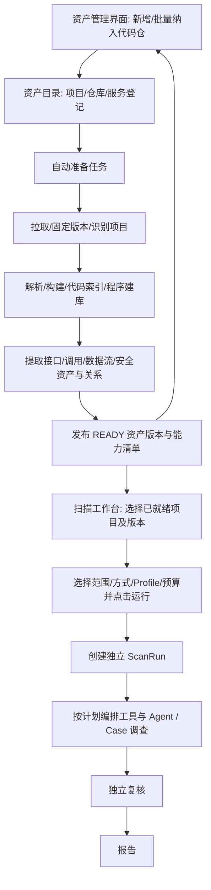

# AIxSecurity 整体架构方案

**状态：2026-09-26 用户已认可方向，进入分阶段实现与多 Agent 评审。** 保留已对齐的双界面、自动资产准备和人选计划；细化可靠执行与效果验证，不另造平台。 本文定义目标系统，不表示现有代码已实现。

## 1. 目标与设计依据

对一个或多个 Java 微服务代码仓进行安全问题发现、独立复核和报告交付。不自动修改目标代码，不建设能力自我进化平台。
核心方法论：**Asset-First，Source-Driven；人选计划，多方法协同，围绕 Case 调查，独立验证定结论。**

依据用户提供的[架构讨论原文](https://chatgpt.com/share/6ab2a00a-41c8-83e8-83ee-70fb26a49dc7)：
- 原则来自原文：先资产、区分 Entry/Source/Sink/Guard、人选 Scan Plan、多方法协同、统一 SecurityCase、独立验证。
- 本文对对象字段、模块接口、失败状态和首版边界的细化属于**随实现复评的工程设计**。
- 原文中的比例、资产数量和轮次只是示例，不转为本项目效果承诺或硬编码参数。

**精简的是重复文档与首版实现范围，不是删掉核心架构。**

### 1.1 判断：架构合理，但效果提升需要验证

| 方案 | 优点 | 主要问题 | 取舍 |
|---|---|---|---|
| 每次扫描重新拉仓/建库 | 初期实现直观 | 重复开销、版本易漂移，资产难复用 | 不作为产品主线 |
| 单一 Agent 读仓后出报告 | 接入链短 | 覆盖分母模糊、证据难核验、易受上下文限制 | 只可作实验对照 |
| 前置计算所有跨仓路径 | 后续查询可能较快 | 路径组合大、准备耗时难控、更新昂贵 | 不将“全路径求解”设为就绪门槛 |
| **可复用资产底座 + 人选计划 + 多方法 Case 调查** | 职责清楚、证据可追溯、重复扫描可复用 | 需要准确的资产模型、框架适配和任务发布机制 | 推荐，在现有方向上补强 |

预期更好的是资产复用、失败定位和结果解释；静态模型缺失可能造成共同盲区，多方法也可能
重复同一证据，独立上下文复核也可能重复模型错误。因此不承诺天然提高召回率或降低误报。
有效性以 testing.md 的对照实验为准，不能以模块数量或单元测试数证明。

### 1.2 本次补强而不改变的边界
1. 两个界面保持独立；资产纳入自动准备，只有人工运行才创建扫描。
2. 对“已就绪”同时说明版本、能力和质量，防止 READY 被误认为支持所有扫描。
3. 准备阶段固化通用资产和查询底座，不预计算无限路径；专项查询留在扫描阶段。
4. 准备/扫描均持久化为任务，临时产物验证后再发布，失败可重试但不覆盖旧版本。
5. 明确 UI/API、对象和执行责任；真实构建隔离与模型调用分离。
6. 先一个可验证的产品闭环，再扩 Profile、多仓传播和吞吐，不把核心架构削成脚本。

## 2. 产品形态：资产管理中心 + 扫描工作台

这是两个独立功能区，不是一次扫描任务执行到中间暂停等人。
**人先在资产界面纳入项目，后台自动准备；准备完成后资产长期处于可用状态。**
随后人在扫描界面选取已就绪项目，选择扫描方法/计划并启动任务。同一资产版本可创建多次扫描。



### 2.1 资产管理中心：纳入和自动准备
- 新增单个/批量仓库链接，配置分支或版本、凭据引用、项目/服务归属及构建所需参数。
- 登记成功即成为资产目录中的项目；“已纳入”与“准备完成可扫描”分别展示。
- 后台自动排队拉取、解析、执行适用构建、生成代码检索索引/程序数据库，提取接口、
  数据流、Source/Sink/Guard、配置、依赖及关系，发布不可变资产版本。
- 界面展示各阶段进度、失败原因、重试入口、当前 commit、就绪版本和已具备的分析能力。
- 详情页浏览模块、接口、关系、构建结果、索引/数据库状态和提取缺口。
- 准备完成即结束该后台任务，资产进入 READY；不创建扫描任务，不调用调查 Agent。

这里“知识库”指可检索、带来源的代码/配置/程序事实，不默认引入向量数据库或让 LLM
重写一遍源码。代码搜索索引、程序分析数据库与统一安全资产库继续各司其职。

### 2.2 扫描工作台：从已就绪资产创建任务
- 选择一个或多个已就绪项目及明确的资产版本，不重复输入仓库链接、不重新做接入。
- 选择广泛、深度、专项等计划模板，以及漏洞类别、范围、预算与验证要求。
- 界面依据所选资产的能力清单显示可选方式；缺前置能力的选项禁用并说明原因。
- 点击“运行”后固定 ScanSpec 并创建 ScanRun；显示任务进度、Case、复核结果与报告。
- 若能力不足，引导返回资产管理中心补充准备或重试；扫描任务不偷偷克隆、重建底座或升级范围。
- 多次扫描可以引用同一 READY 版本，互不改变底座；取消扫描也不删除已准备资产。

后续扫描仍会进行专项程序查询、数据流求解和补证，这是使用已准备底座，不是重新建库。
“自动前置处理完成”不意味着枚举完所有可能漏洞路径。

### 2.3 两套独立生命周期

**资产准备：** REGISTERED → QUEUED → PREPARING → READY；异常进入 PARTIAL/FAILED。
PARTIAL 表示准备不完整，留在资产管理中心处理；默认扫描列表只提供 READY 版本。
READY 按接入配置的必要产物与一致性校验判定，携带明确能力清单，不表示支持所有扫描方法。
例如某项可选提取器未配置可以是 READY 但不支持相关计划；必要建库失败则不是 READY。

**扫描执行：** CREATED → VALIDATING → QUEUED → RUNNING → VERIFYING → COMPLETED；
另有 FAILED/CANCELLED 等终态。只有人工点击运行才创建 ScanRun，验证不通过就停止，不启动 Agent。
执行状态不等于覆盖完整：单独记录 coverage_status（complete/partial/unknown）、stop_reason、
失败/未支持/未处理项，以及 report_status（pending/available/failed）。COMPLETED 只表示任务收束，
不表示所有目标均已分析。预算耗尽或局部失败可发布明确标注不完整的报告，不改写为“未发现问题”。
验证器执行失败的 Case 保持未复核，不自动映射为 rejected 或已复核 suspicious。

资产没有 WAITING_FOR_SELECTION 状态：它是已就绪的长期资源，不是挂起的扫描任务。
后台准备任务和扫描任务分别记录 ID、状态、日志、工件与错误。

### 2.4 更新和多仓版本
首次纳入自动准备。首版建议在资产页面手动点击“更新/重新准备”后由后台自动执行；
Webhook/定时更新属于待确认扩展，不默认开启。
新 commit 准备时保留旧 READY 版本和历史报告；新版本通过校验后再发布，运行中的扫描不切换输入。
多项目扫描绑定每个项目选定的 asset_snapshot_id 和 commit；缺失/未就绪成员不静默跳过。

## 3. 八个逻辑模块及输入输出

| 模块 | 输入 | 输出 | 主要边界 |
|---|---|---|---|
| M1 资产管理与仓库接入 | 资产界面提交的 Git 链接集合、ref、接入范围 | 仓库集合接入清单、RepoRevision、模块/服务映射 | 固定 commit；不自动认为多个仓库属于同一部署 |
| M2 代码处理与建库 | RepoRevision、接入配置、工具版本 | 源码索引、构建诊断、程序分析库及能力清单 | Sourcebot/CodeQL 为可替换适配；数据库就绪不等于资产完整 |
| M3 安全资产发现与关联 | 源码/配置/索引/可用程序事实 | AssetSnapshot、RepositorySetSnapshot、关系图、ReadinessReport | 统一 Entry/Source/Sink/Guard；保留来源、精度和未知项 |
| M4 扫描工作台与计划管理 | 人选 READY 资产版本、模式/范围/Profile/预算、ReadinessReport | 固定版本 ScanSpec、前置条件检查结果 | 管计划不做推理；无人工选择不启动扫描 |
| M5 扫描编排与分析服务 | ScanSpec、AssetSnapshot、Profile | AnalysisTask、证据、触发、覆盖缺口 | 确定性分配方法和任务，统一查询工具；不自签结论 |
| M6 Case 管理与 Agent 调查 | 触发与证据、Profile、预算 | SecurityCase、补证请求、支持与反证、调查轨迹 | 合并来源、按 Case 分工；Agent 不更改人选计划 |
| M7 独立验证 | Case、原始证据、验证规则 | Verdict、关键依据、待补证项 | 初判不能替代独立复核，执行失败不是 rejected |
| M8 报告交付 | Verdict、证据、覆盖/构建/版本信息 | Finding、JSON、Markdown | 确定性表达，不补写未经验证的结论 |

这是职责分组，不是八个微服务或八个常驻 Agent。资产管理界面属于 M1，扫描选择/任务界面属于 M4；两者都是首版产品必需入口。
内部的 Query Service 归 M5，Profile 定义由 M4 引用，Agent 工具调用也经过 M5 的范围/预算检查。
共用支撑仅包括运行记录、工件、身份/凭据隔离、日志和预算计量，不另起平台主线。

### 3.1 数据交接与所有权
M1 写仓库版本清单；M2 写工具产物；M3 发布资产快照；M4 固定用户选择；
M5 提交任务状态和查询结果；M6 更新 Case；M7 写 Verdict；M8 渲染报告。
Agent 只能提出查询/假设，不直接写资产事实、任务授权或最终裁决。

每个阶段交接最少携带 input_refs、output_refs、versions、status、errors、coverage_gaps。
来源不足的关系保留为 candidate/unknown；工具错误和业务否定分开。

### 3.2 资产就绪条件（草案）
ReadinessReport 按仓库、模块、资产类别分别列出：
- 输入已固定，未获取的仓库有明确错误，不能悄悄从集合移除。
- 无构建提取已完成或明确失败；所有资产可追到源码位置和提取器版本。
- 搜索索引与程序库分别记录 available/partial/unavailable 及对应 commit。
- 提取支持范围、未解析符号、构建失败模块与冲突关系可见。
- 快照已发布，引用完整；明确支持的方法和缺失前置条件。

就绪判定与第 2.3 节一致：必要步骤完整且引用一致才发布 READY。能力缺失影响可选计划，
不以“接入成功”冒充“准备完成”；部分/失败项目可查看和修复，但不进入默认可运行项目集合。

## 4. Java 静态安全资产模型（核心底座）

### 4.1 需要发现的资产

| 资产域 | 完整目标模型 | 首版建议优先提取 |
|---|---|---|
| 代码结构 | Repo、Module、Service、Package、Class、Method、Field、Annotation | Maven 模块、类/方法、注解与符号位置 |
| 触发入口 Entry | HTTP、RPC Provider、MQ Consumer、WebSocket、Listener、Job、CLI、回调 | Spring MVC HTTP、基础 Scheduled Entry |
| 数据输入 Source | HTTP 参数/body/header/cookie/upload、RPC/MQ 字段、外部文件、二阶存储输入 | Spring/Servlet 参数和上传元数据 |
| 敏感操作 Sink | SQL、文件、命令、网络、反序列化、表达式、反射、XML、敏感数据操作 | 初选漏洞 Profile 对应的 SQL/文件/命令操作 |
| 防护 Guard | 认证、授权、归属/租户、验证、净化、编码、规范化、白名单 | 常用权限注解与参数化/路径检查候选 |
| 数据资产 | 数据库/表、Redis、文件、对象存储、消息主题 | 可识别的数据访问与文件资源引用 |
| 外部交互 | HTTP Client、RPC Client、MQ Producer、第三方 SDK | HTTP 客户端和可识别目标引用 |
| 环境事实 | 依赖、构建、配置、框架、安全配置 | pom、YAML/properties/XML，依赖与框架标记 |

这是提取范围设计，不承诺首版完整理解所有框架。每类资产必须有 supported/partial/unsupported
及原因；不把首版未实现的 RPC/MQ/二阶路径从目标数据模型中删除。

### 4.2 四类对象不能混淆
- **Entry Root**：触发执行的位置，例如 HTTP Endpoint 或 Scheduled Job。
- **Taint Source**：具体可控数据，例如 endpoint 的 path 参数；与 Entry 用关系关联，不合并成一个字段。
- **Asset Root**：依赖、配置、秘密等资产检查的出发对象；不强套污点路径。
- **Security Guard**：观察到的保护机制；“发现注解/校验调用”与“对当前路径有效”是不同状态。

例如：Job 是 Entry；Job 从数据库读到的值，只有在写入来源和信任边界有证据时才能认定为
二阶不可信输入。Path.normalize 的存在不等于路径遍历已被防止。

### 4.3 字段与来源契约（草案）
- 共同字段：asset_id、kind、repo_revision、service/module、symbol、location、extractor_version、evidence_refs、resolution_status。
- Entry：协议/触发类型、路由或处理方法、绑定参数、可见性。
- Source：关联 Entry/存储资产、数据类型、trust_level、control_origin、constraints、条件证据。
- Sink：操作类别、目标符号、敏感参数位置、框架语义引用。
- Guard：保护类型、作用对象/条件、适用路径、observed/proven/unknown 状态和证据。
- Relation：from/to、关系类型、条件、来源、解析精度（确定/候选/未知）。

示例关系：CONTAINS、EXPOSES、CALLS、READS、WRITES、FLOWS_TO、GUARDED_BY、HTTP_CALL、PUBLISHES/CONSUMES。
关系图用于导航，不等于漏洞成立的精确数据流。精确路径通过 Query Service 回查并带来源。

## 5. 两阶段资产发现与快照复用

**Pass 1：No-Build。** 解析 Git 文件、Java 语法/注解、构建文件、配置和框架线索，生成基础资产。
标记 unresolved 符号和推断关系；不把文本匹配关系标为精确调用边。

**Pass 2：Build-Enhanced。** 隔离执行构建，提取类型、符号、接口实现、候选动态分派、调用与数据流，
关联分析数据库，再增强同一语义资产模型。CodeQL 是设计中的主要候选，版本/兼容性在实施前核验。

**合并规则：** 保留每个提取器来源；精确事实可增强低精度记录，但冲突保留为 conflict，不静默覆盖。
快照生成后不可原地改语义事实；新提取结果生成新 revision。

**复用键：** 不只使用 commit；还须包含源码/配置内容摘要、提取器与框架模型版本、构建上下文和分析工具版本。
同一版本的资产供 SQLi、路径、鉴权等不同扫描计划复用。结果缓存另包含 Plan/Profile/模型/提示版本。

**构建失败：** 保留 Pass 1 产物和失败诊断；必要构建失败则资产保持 PARTIAL/FAILED，
由资产中心修复或明确调整准备配置，再重新校验发布。扫描工作台不临时降级以绕过就绪条件。跨 commit 增量提取保留设计接口，首版先全量重建并验证快照复用。

### 5.1 三类查询数据加一份代码事实源

| 数据层 | 负责什么 | 不应混淆 |
|---|---|---|
| 代码镜像与 RepoRevision | 固定原始源码、文件哈希、commit | 不是分析结果 |
| 代码搜索索引（Sourcebot 候选） | 跨仓找代码、定义、引用和配置上下文 | 搜索结果不是精确污点证明 |
| 程序分析数据库（CodeQL 候选） | 查询程序结构、调用/数据流及路径证据 | 工具库不是统一业务安全资产模型 |
| AIxSecurity 安全资产库/关系图 | 归一化 Entry/Source/Sink/Guard、服务和来源关系 | 不复制所有底层事实，不自动证明跨服务传播 |

Sourcebot 官方提供跨仓搜索、代码导航和带引用的代码问答；CodeQL 官方将流程区分为
数据库创建、查询执行、解释结果。这两种工具职责互补，不是二选一，也不要求首版都部署。
工具能力与 AIxSecurity 适配完成度分开：当前还没有验证本地集成、Java 框架精度或固定版本检索。
资料：[Sourcebot 官方仓库](https://github.com/sourcebot-dev/sourcebot)、[CodeQL 官方概述](https://codeql.github.com/docs/codeql-overview/about-codeql/)。

统一 Query Service 对外按功能暴露 source_search、read_symbol、lookup_asset、find_callers、
trace_flow、query_relations 等设计接口；每个结果必须带 repo/commit/asset_snapshot/来源/精度。
若索引只能给出当前分支结果，不能将它冒充固定快照证据；应重新校验文件哈希或返回版本不匹配。
尚未选择专用图数据库；上述是逻辑数据职责，不意味着部署四套数据库服务。

### 5.2 多仓微服务的版本与关联

输入可以是一个链接，也可以是链接集合。RepoRevision 固定为 repo_id + commit。
**AssetSnapshot 固定为单仓不可变版本**，绑定一个 RepoRevision、准备配置/工具/框架模型摘要和产物。
**RepositorySetSnapshot 是不可变多仓成员清单**，至少记录 set_id、每个 repo_id 对应的
asset_snapshot_id/commit、模块/服务映射、配置上下文引用及缺失成员；成员引用已发布的单仓快照。
Project 是长期目录身份，不承担版本身份。整组有必要成员缺失时不发布为可运行集合；
单仓准备成功不等于所属多仓集合准备成功。更新任一成员产生新集合，不替换旧集合成员。
多个 commit 组成分析集合，不自动代表同一时间或同一生产部署；部署关系需要独立证据。

Repo → Module → Service 不是固定一对一：一个仓可以有多个服务，一个服务也可能依赖多个仓。
服务关联可依据 HTTP 路由/客户端、RPC 接口、MQ topic、配置中的服务名等形成候选关系。

严格区分四级：代码搜索线索 → 关联关系 → 跨服务传播路径 → 已验证安全问题。
同名路由/topic 不是充分证据；还要检查环境、目标解析、消息字段、转换与身份前提。
跨进程传播由模型与证据拼接，不假设把多个 CodeQL 数据库放在一起就自动产生跨服务数据流。

多仓资产汇总可先实现，跨仓漏洞求解后实现；未解析远端边应出现在 Case/报告的缺口中。
单仓试验只是首个验收样本，不应把存储模型改成只支持一个 repository_id。

### 5.3 工具选型的精度边界（官方资料核验）

Java 建库不必然要求成功编译：GitHub 当前文档列出 Java 的 none/autobuild/manual 模式。
none 模式可能通过 Maven/Gradle 获取依赖信息，因此不代表完全不执行项目相关工具；
混合 Kotlin 项目须明确覆盖缺口。我们的“无构建基础提取”和“构建增强”是产品处理层次，
不与 CodeQL 的模式简单一一对应。准备记录必须保存实际工具版本、构建模式及提取范围。
参见 [CodeQL 构建模式](https://docs.github.com/en/enterprise-cloud%40latest/code-security/reference/code-scanning/codeql/build-options-for-compiled-languages)。

CodeQL 的全局数据流比局部分析更有成本和建模限制，不能把“抽取数据流信息”写成
“前置阶段已求出所有漏洞路径”。参见 [数据流分析说明](https://codeql.github.com/docs/writing-codeql-queries/about-data-flow-analysis/)。
Sourcebot 维持为检索/导航适配候选；其固定版本寻址、权限映射、引用精度和本地集成待实测。
首版不同时承诺完整 Sourcebot、向量库、图数据库及所有分析器的集成。

## 6. Scan Intent、Scan Plan 与 Vulnerability Profile

### 6.1 人决定扫描策略
Intent 表达目标、范围、漏洞类别、深度、时间/调用预算；Scan Plan 是团队维护的版本化执行模板。
保留快扫、深扫、专项、变更扫描等扩展语义，不恢复动物命名，也不要求首版全部实现。
保留广泛/深度/专项三个用户可理解的选择维度（不是动物品牌模式）。
首版建议：**一个人工选择的 Java 专项深扫模板**，由 Profile 参数选择漏洞类别；首轮采用 SQLi，新增类别经阶段验收后扩展。

ScanSpec 至少绑定：plan_id/version、target/asset_snapshot、scope、profile_refs、analysis_methods、
build_requirements、fallback_policy、agent_budget、verification_policy、output_policy。
scope 分为 analysis_scope（允许提出候选问题的目标）和 context_scope（允许读取的依赖上下文）；
authorized_snapshots 是项目/版本硬边界。读取同版本 Service、Repository 或配置不自动扩大候选
发现范围；越界新问题只能建议另建计划。ScanSpec 固定 snapshot_refs[] 或集合引用，禁止运行时解析 latest。
计划缺少必要分析能力时在工作台禁用或验证拒绝，并指向资产中心处理，不静默关掉方法。Agent 可建议另开计划，但必须由人决定。

### 6.2 Profile 是专业分析模型，不是一段 Prompt
每个 Profile 包含：适用 Root、Source、Sink、Propagation、Sanitizer、Guard、Framework Models、
Search Strategies、Agent Playbook、Verification Rules，以及版本和测试样本。
SQLi、路径遍历、SSRF、鉴权的专业规则不同；首版只实现选定的 Profile，不在代码里锁死一种漏洞。

### 6.3 扫描深度与方法是两个维度
一个计划可以组合多种方法。同一方法也可被多个计划复用。深扫允许更多时间和调查轮次，
但仍受用户明确预算和停止条件约束，不再由实现随意统一硬编码“两轮”。

## 7. 多方法分析如何协作

1. **Source-first 主搜索**：选择 Profile 的可信 Root/Source 定义，向目标 Sink 追踪传播与边界。
2. **Sink-first 补漏**：枚举该类别 Sink，反查尚未关联的输入与调用方，保留不可解析原因。
3. **Rule/AST 补特征**：快速发现结构和模式线索，不将文本命中直接写为已确认漏洞。
4. **CodeQL/程序分析与 Graph**：提供数据流/路径证据和全局导航，支持前两条搜索。
5. **Agent 语义补充**：在计划内审查业务前提、配置、框架保护和缺失关系，可提出新 Case。

鉴权等 Profile 用 Entry → Sensitive Operation → Guard 检查链，而非强行走 Taint Source → Sink。
覆盖至少分开记录：Root/Sink 清单、实际分析项、未解析项、失败项和未支持项。
没有完整分母时不输出“覆盖率 100%”；不能用 Case 数量冒充覆盖率。

## 8. Security Case、证据与 Agent 分工调查

### 8.1 统一 Case
草案字段：case_id、profile_ref、asset_snapshot_ref、triggers、entry/source/sink/asset_refs、
path_refs、context_refs、hypotheses、supporting_evidence、counter_evidence、gaps、analysis_trace、state。
跨仓 Case 使用 snapshot_refs[] 或 repository_set_snapshot_ref，不用单个快照字段冒充多仓证据。
Case 具有递增 case_revision；变更支持、反证或关键前提后计算新的 evidence_digest。
Evidence 至少绑定工具与版本、查询参数、commit/快照、源码位置、工件哈希、获取方式及精度。

多方法命中同一操作时做关联，不只按行号去重；不同输入、路径和前提保留独立分支。
同一 CodeQL 路径被不同方法引用仍是同一证据，不重复加权。

Case 状态草案：open → investigating → ready_for_verification → reviewed。
执行失败单独记录，不能用 rejected 表示“没跑完”。

### 8.2 Agent 分工由编排器落实
人的选择先变成 ScanSpec，M5 按 Profile、方法、服务/模块和 Case 拆成任务，
再分配调查 worker；不是先放出多个 Agent，让它们自行决定如何扫整个仓库。
同一个 Investigator 可以加载不同 Profile/Playbook，不必每个漏洞类型常驻一个 Agent。
同 Case 的并发修改用版本检查或单写入者合并；任务失败可见，不把重复执行当独立发现。
Reviewer/Verifier 使用独立上下文，Reporter 通常无需 Agent。

### 8.3 Agent 是调查者
输入是 Case + Profile + 有限且可溯源的上下文，不是整仓任意聊天。
可读源码、查调用者、查 Source/Sink/Guard、查配置、请求精确路径、寻找支持与反证。
每个请求经过计划范围/预算检查；记录工具请求与结果引用。

停止条件：证据足够支持或否定、需要外部事实、预算耗尽、工具缺失、无新增证据。
预算耗尽输出缺口而非编造结论。工具输出和代码注释仅作数据，不能更改扫描计划或权限。

## 9. 独立验证与报告

Verifier 使用原始证据和独立上下文，先检查成立前提、防护是否有效、路径是否匹配，再对照初判。
同模型独立调用仅代表上下文分离，不能宣传模型错误独立。

Verdict 草案：confirmed（在注明证据层级下成立）、suspicious（待补证）、rejected（被反证排除）。
每项绑定 verification_method、理由、关键证据与限制；static_review 与 runtime_verified 分开。
Verdict 必须绑定 case_revision + evidence_digest + verifier_version；Case 或证据变更后旧裁决保留
审计记录但失效，报告只引用匹配当前版本的有效裁决。复核提交采用版本条件检查，拒绝过期结果。
动态验证不是首版必经步骤，未经运行证明的内容不能写成“已成功利用”。

报告包含：commit、资产/构建状态、Plan/Profile/工具/模型版本、实际方法、覆盖缺口、问题和待确认列表。
每个问题含位置、路径、支持/反证、成立条件、验证方法与影响说明。排除项留审计记录。
不自动改目标代码；本项目也不在此次范围实现规则自我进化与自动回灌。

## 10. 首版范围、部署与验收边界

**建议首版验收样本：** Java、单仓、Maven/Spring MVC 为优先候选；输入与数据模型兼容多仓集合；一个专项深扫 Plan；先一类 Profile 通链，
再复用同架构增加其他类别。用户已认可按此切片推进，具体样本与工具适配以实际核验为准。
首轮 SQLi 必需提取 Maven 模块、Spring MVC Entry/参数 Source、实际选定数据访问框架的
SQL Sink/参数化 Guard、调用/流证据及配置来源。第 4.1 节其他资产域保留模型和 unsupported
说明，不把 Scheduled、上传、文件/命令及 HTTP Client 全部提取设为首轮完成前提。

**完整保留：** 两阶段资产发现、统一资产/Case 模型、人选 Plan、Profile、多方法、Agent 调查、独立验证。
**延后实现：** 多仓路径求解、RPC/MQ 全面建模、完整二阶分析、增量重建、分布式调度、多种计划模板。
延后不等于删模型：asset_id/refs 保留 repo/service/module 维度，缺失边显式表达。

部署先单体。资产和 Case 可用关系表/JSON 与文件工件表达，尚不决定引入专用图数据库；
构建与分析执行在隔离环境，模型凭据不进入第三方构建脚本。工具选型与资源预算在设计通过后验证。

验收不是“编译成功+模型写了报告”，而是资产可追溯、多方法共享 Case、反例有处理、
构建失败能保留基础资产、计划边界受控、真实证据支撑结论。

## 11. 可实施的部署与任务执行设计

### 11.1 推荐最小部署
```text
Web UI（资产中心 / 扫描工作台 / 结果详情）
                ↓
模块化后端 API（八模块的业务规则）
     ├─ 元数据与任务库（持久状态、引用、版本）
     ├─ 工件存储（源码快照、索引、分析库、证据、报告）
     └─ 后台任务执行器
          ├─ 准备执行池：拉仓、解析、隔离构建、建库与提取
          └─ 分析执行池：查询、Case 调查、模型请求与复核
```
两个执行池首先是不同资源/凭据边界，不要求多台机器或独立微服务。
起步采用单实例后端与有并发上限的后台 worker；不在 Web 请求内同步构建，也不依赖进程内
临时队列保存长任务。任务可先持久化在同一关系数据库，暂不引入独立消息总线/K8s。

元数据主存储的首版选择需用并发样本验证；已有 SQLite 账本可参考，但不当作现成任务调度器。
工件先支持本地目录抽象，后续可替换对象存储；图先用资产/边表与查询表达，测到瓶颈再换图库。
前端框架、数据库产品和隔离执行器在技术验证阶段确定，不虚构已有基础设施。

### 11.2 自动准备是带发布门禁的任务图
步骤：fetch → inspect → parse/index → build/extract → normalize → validate → publish。
可独立的解析/索引允许有限并行；资源昂贵的构建有单仓和全局并发、磁盘/时间限制。
每个步骤保存 input_digest、tool_version、config_digest、attempt、状态、日志和产物哈希。

- 同一仓库版本+准备配置+工具版本的重复提交合并或复用，不反复创建全量构建。
- worker 领取带租约/attempt token 的任务；过期执行器结果不得提交到新 attempt。
- fencing 覆盖步骤状态、工件 manifest 绑定和最终发布：每次提交在同一数据库事务内检查
  当前 attempt token 与未过期租约。仅领取任务时检查不够；旧执行器产生的文件不能成为发布引用。
- 工件先写 attempt 临时区；完整性通过后提交 manifest，再由数据库事务更新发布引用。
- 工件与数据库不假装具备跨系统事务：发布中断由协调检查恢复，孤立临时工件按保留策略清理。
- 瞬时网络失败有限重试；缺凭据/依赖/错误 JDK 则停止并在资产页面给出明确操作入口。
- 准备完成事件只更新资产，不自动调用扫描 API。重试不重复发布同一版本。

这只解决本产品后台任务的必要可靠性，不扩成通用工作流平台。

### 11.3 资产版本、就绪与计划能力
项目身份与版本分开：Project/Repository 是长期目录；AssetSnapshot 是不可变版本。
每个发布版本包含 capability_manifest（如源码检索、接口资产、局部/全局流查询、框架覆盖）
及 quality_report（支持模块、未知符号、失败项、来源精度）。

READY 表示满足事先声明的 PreparationProfile 必要步骤，不允许在构建失败后悄悄降低要求。
扫描前检查 Plan.required_capabilities 是所选全部资产能力的子集，同时检查必要质量条件。
前端禁用仅是提示，后端须再次验证；缺能力则返回原因并引导资产中心重新准备。
首版默认的 Java 深度准备必须尝试约定的建库步骤；轻量准备配置如未来需要，应显式定义，
不是 Agent 临时选择的失败降级。

### 11.4 核心对象与 API 轮廓（设计契约，不是现有接口）
| 对象 | 关键字段 | 写入方 |
|---|---|---|
| Project / Repository | project_id、repo_id、URL、credential_ref、service/module 映射 | 资产管理 |
| PreparationJob | repo_revision、preparation_profile、attempt、步骤状态、错误、产物引用 | 准备执行器 |
| AssetSnapshot | snapshot_id、单仓 repo_revision、准备/模型/提取器版本、资产/关系引用、capabilities、quality | 资产发布器 |
| RepositorySetSnapshot | set_id、不可变 repo_id → asset_snapshot_id 成员表、服务映射、缺失成员 | 集合发布器 |
| ScanSpec / ScanRun | 选定 snapshot 集合、Plan/Profile 版本、预算、用户、状态 | 扫描 API/编排器 |
| SecurityCase | 触发、资产/路径/证据引用、分支、支持/反证、缺口 | Case 引擎 |
| Verdict / Report | case_id、case_revision、evidence_digest、证据层级、理由、验证版本、报告工件 | 验证器/报告器 |

接口分组建议：纳入项目、查询准备进度、重试/更新准备、浏览指定快照资产、
查询兼容计划、验证扫描请求、创建扫描、查询/取消扫描、查看 Case 与报告。
纳入/运行请求带幂等键；键按调用者/操作隔离并绑定规范化 payload_digest。相同键和相同
payload 返回原资源；相同键但不同 payload 返回冲突，不静默复用旧任务。并发提交由唯一约束
和事务保证原子创建。创建扫描返回 run_id 而非等待报告。拒绝响应含可操作原因。
资源校验绑定具体项目/仓库/工件；传参不能读取任意文件路径或运行任意 shell。

### 11.5 两个界面的最小交互
资产列表显示项目、仓库/服务、当前准备状态、已发布版本、能力摘要、最近错误；
详情页分概要、接口/Source/Sink/Guard、服务关系、构建与建库记录、历史版本。
更新失败时同时显示“旧版本可用”和“新版本失败”，避免一个状态覆盖另一个状态。

扫描工作台按已发布版本选择单个/多个项目，依次选计划/Profile、范围、预算并预览执行摘要；
预览含 commit 集合、将运行的方法、不可用能力和估计任务数量。确认运行后进入任务详情，
展示阶段进度、已审查/待审查 Case、停止原因、复核与报告，不用虚构进度百分比。
一次点击的重试不应创建重复任务；预算和实际费用区分，无法获取用量则标记 unavailable。

### 11.6 风险与成本边界
Git 凭据仅用于拉取，第三方构建不继承 Git/模型密钥；构建环境使用受限身份、独立工作区、
资源限额与受控依赖网络。关闭依赖下载之外的默认外联能力需在选定执行器实测。
隔离执行器不可用时构建/依赖解析步骤进入 blocked，记录原因；不降级为在宿主机执行第三方
Maven/Gradle 脚本。JDK/Maven 可用不是隔离验收通过；无构建建库模式也须核验实际执行行为。
源码/配置中的秘密不进入模型上下文；上下文按项目授权与最小必要片段取用，工具输出不当指令。

预算分别计量准备 CPU/磁盘、查询时间、模型调用和报告存储；只缓存输入/版本匹配的结果。
正在被扫描或报告引用的快照不能被清理；保留周期、删除权限和空间阈值在部署验收时确认。
多方法并非越多越好：重复工具结果用统一 Case 归并，按 testing.md 实验淘汰无增益开销。

## 12. 当前事实与评审门禁

当前 0.6.0 已有分层框架、M1 目录登记/事务入队、M4 纯计划校验，以及任务、工件、证据和模型传输组件。
完整 Java 资产准备/分析/Agent 链尚未实现；准确模块状态与依赖边界见第 13 节和 README。
JDK 21/Maven 可用；CodeQL 不在 PATH；Docker daemon 未连接。用户后来已提供本地模型配置，
取代此前暂缓决定；模型列表请求成功，但生成测试尚未通过（auto 响应不匹配、显式模型 HTTP 429）。
G0 的真实目标、程序分析与隔离门禁尚未通过，组件测试与安装验证不等于完整产品验收。

### 12.1 本轮多维度评审修订
- 架构一致性：明确单仓快照/多仓集合、分析与上下文范围、首轮必需资产边界。
- 执行可靠性：幂等 payload 冲突、全发布链 fencing、覆盖状态与报告状态分离。
- 证据可信性：裁决绑定 Case/证据版本，变更后失效，不把复核失败当反证。
- 环境边界：隔离器缺失阻塞第三方构建；真实分析未过、模型真实调用主动暂缓，不伪造完成。
每轮实现后按这些契约复评，记录真实通过项和阻塞项，再推进下一阶段。

## 13. 0.6.0 代码框架与依赖约束

采用模块化单体与端口/适配器分层，先实现有业务行为的模块，不建立空微服务。

| 代码边界 | 所有权 | 依赖约束 |
|---|---|---|
| domain/assets.py | 登记输入规范与仓库标识 | 纯函数；不解析 DNS、不拉取 |
| domain/planning.py | 不可变 Snapshot/ScanPlan/ScanSpec 与必要能力 | 只验证已提供的数据；不授予 READY 或执行权限 |
| domain/evidence.py | SQLi 证据与复核记录的一致性 | 不调用模型或数据库 |
| application/ports.py | CatalogPort 存储契约 | 使用 Protocol，不依赖具体 SQLite 类型 |
| application/assets.py | M1 登记/列表/详情用例 | 通过 CatalogPort 单次提交原子登记需求 |
| application/planning.py | M4 计划校验用例 | 不创建任务，后续从可信快照存储取输入 |
| adapters/catalog.py | 目录与准备任务的事务一致性 | 与 TaskStore 属同一持久层，事务内 enqueue；不复制任务写入 SQL |
| adapters/tasks.py、artifacts.py、model.py | 任务租约、内容寻址、本地模型传输 | 不反向调用 CLI 或装配入口 |
| composition.py | 连接/适配器实例装配与释放 | 唯一入口到具体适配器的连接点；导入无 IO |
| entrypoints/cli.py | 参数解析、调用用例、格式化结果 | 不写 SQL，不实现领域校验 |

依赖测试禁止 domain/application 导入 adapters、entrypoints、composition 或网络/数据库执行接口。
未来 HTTP API 与 CLI 复用 AssetService；Web 页面不直接调用存储。单请求/worker 独占连接，
不把 SQLite 连接跨线程共享。当前为单用户本地框架，尚无多租户/访问控制产品能力。

M2/M3 的真实处理与发布、M5/M6 的执行循环及 M8 报告器保持待开发；只在实际实现时新增文件。
目录表的 current_snapshot_id 暂为 null：任务 completed 不等于快照发布成功。
M4 当前只检验合成/上游提供的快照元数据，尚无可信查询与持久化扫描创建入口；不得外部传入 READY 就启动扫描。

逐模块工作约定：先定输入输出和错误语义 → 纯规则测试 → 端口与存储实现 → 跨层集成 →
独立评审 → 完整回归 → Git 提交。外部工具缺失不阻塞纯组件开发，但不降低真实阶段门禁。

## 14. 首条真实端到端实现（2026-09-27）

本轮沿既定双入口流程实现，不把全架构等同于已全部交付。首条计划限定为 Java/Maven + SQLi 单函数分析。

```text
浏览器资产中心 → PlatformService / Catalog → 持久 preparation 任务
  → GitHub HTTPS 固定 commit（拒绝仓库符号链接）
  → Docker 内 Maven compile（不挂载宿主凭据，有限资源/时间）
  → Semgrep CE Java AST 资产规则 + taint 规则
  → 源文件 SHA256 清单 + 编译/分析成功门禁 → 不可变准备结果发布
浏览器扫描工作台 → 人工选 READY 项目 → 独立 scan 任务
  → 固定快照候选 → Investigator 申请受控源码读取 → 判断
  → 独立上下文 Reviewer → JSON/Markdown 报告与覆盖缺口
```

本轮具体模块：application/platform.py 定义界面用例和端口，adapters/platform.py 管任务/快照引用的原子性；
java.py 管隔离编译和真实 Semgrep 执行；pipeline.py 是后台执行器；investigation.py 实现有预算的三阶段模型调用；
application/reporting.py 只排版已有结论；entrypoints/web.py 是回环地址单用户 HTTP 服务，static 为双界面。

### 精度与发布门禁
- 首轮采用 Semgrep CE 而非假定已安装 CodeQL；真实能力名为 java-ast/java-sqli-intraprocedural/maven-compile。
- 能力取所有仓库真实产物的交集，不能凭空声称全局/跨方法数据流。实际全链验收仍先单仓。
- READY 需要任务 URL 集合、完整 commit、成功编译、成功分析、工具版本、候选源码哈希清单一致；只表示该配置就绪。
- 当前 SQLite 存储版本化准备结果与完整资产/候选 JSON；不是 CodeQL 数据库，也不是 Sourcebot 全文服务。
- 调查前对源码重新计算哈希并与快照比对；Agent 只可读当前候选 Java 文件及限定行数，不执行模型提供的命令。
- 当前 CE 输出缺少完整 dataflow trace；即使模型支持漏洞成立，也保留 suspicious，不冒充程序路径证明或动态利用。
- 默认只调查前 3 个候选，最多 10 个；报告明确剩余候选未处理，独立复核失败标 unreviewed。
- 同模型的独立上下文是职责分离，不代表模型错误独立。报告可生成不代表范围全部完成。

### 当前工程边界
服务仅绑定 127.0.0.1；Host、Origin 与自定义请求头约束变更请求，未建设多用户认证与远程部署。
准备失败可人工重试，每次保留独立任务；一次构建在相同容器内最多两次 Maven compile，不关闭 TLS 校验。
Maven repository 使用按工作区、仓库、commit、镜像与构建脚本隔离的 Docker named volume；显式重试可复用已下载依赖。
不挂宿主 ~/.m2，不持久化 settings.xml；缓存需有后续保留/清理策略。
Docker依赖下载网络暂未做域名级白名单，不部署或运行靶场Web服务。服务停止时不保证立即终止已开始的外部任务；
任务有租约，重启后不能让旧 token 发布。执行器使用独立连接续租，按 task/attempt/token 隔离目录；丢失租约禁止发布。
生产级进程取消、细粒度进度与多仓发布库仍需后续完善。
静态分析拒绝零 Java 输入/零 Java 扫描，并记录未扫描文件及超限文件；候选 ID 绑定仓库与 commit。

## 15. 导航与扫描能力扩展（0.8.0）

### 信息架构

```text
项目总览      项目就绪情况、运行任务、覆盖状态；计数全部来自持久数据
资产中心      纳入仓库、准备状态、版本/能力、显式重新准备
扫描工作台    选择READY项目 → 选择有原生能力支持的专项 → 人工运行
审计报告      历史扫描、覆盖与复核数、发现/证据、JSON/Markdown
能力目录      后端已注册Profile及要求，不把计划中的模式当成可用能力
```

保留模块化单体与既有八模块，不因菜单变化改业务边界。首次准备与显式更新均自动执行前置工作；任何准备成功都不自动发起审计。
旧版本在重新准备期间保持可用，新准备失败不覆盖旧快照；旧扫描始终固定原快照。后台task_status与可用资产READY分开表达。

### Profile契约

领域层定义不可变Profile：ID、中文名称、类别、能力要求和复核关注点；API只暴露展示字段。
`POST /api/scans` 接收 `profile_id`，省略时兼容原SQLi专项。幂等键绑定项目+Profile+显式预览版本；数据库事务内检查READY、版本一致性与原生能力再入队。
新版前端提交expected_snapshot_id；若当前版本已变更则拒绝，避免把用户预览的A静默替换为B。省略版本的旧客户端保持兼容。
准备幂等响应以operation.task_id指向原请求任务，项目字段单独显示当前最新状态，避免重放旧请求误指向新任务。
Worker把持久Plan传入调查器；只调查对应规则和类别匹配的候选，不把全部SQLi结果复用于其他模式。

| Profile | 原生能力 | 复核重点 |
|---|---|---|
| sqli-intraprocedural-v1 | java-sqli-intraprocedural | 输入影响SQL结构、执行与参数绑定 |
| command-injection-intraprocedural-v1 | java-command-injection-intraprocedural | 可控命令、显式shell、参数语义与白名单 |
| path-traversal-intraprocedural-v1 | java-path-traversal-intraprocedural | 实际文件访问、可信根目录约束与规范化 |

全部仍为Java单函数静态候选分析。普通进程参数不自动等价于shell注入；normalize不自动等价于路径边界检查。
扩展类别不改变裁决门禁：缺少经过验证的程序路径证明时，模型赞同也保持待确认。
旧SQLi快照可从已知规则ID推导类别，但不补造新能力；新专项需要新规则完成真实准备后发布的新快照。


### 界面布局与交互约定
- 桌面采用固定左侧导航、顶部连接状态、右侧工作区；资产列表与接入表单并列，扫描配置与任务列表纵向组织，报告与配置分区。
- 使用深蓝导航（#172b4d）、蓝色操作（#265dca）、浅灰工作区（#f2f5fa）、白色内容与边界线（#dce3ed）；中文系统字体，代码版本等定位信息用等宽字体。
- 总览展示真实项目、准备/审计任务、报告及失败准备，不把所有计数拼成漏洞数；列表明确专项名称。
- 窄屏导航横向换行，配置单列；键盘焦点可见，切换菜单回到标题，hash支持报告定位与刷新恢复。
- 数据未变不重建DOM；轮询保留已选专项、焦点与展开证据。证据JSON折叠，默认展示位置、仓库、判断、复核与覆盖状态。
- POST结果不确定时保存原完整payload和幂等键，重试不受轮询版本变化影响；显式放弃本地等待不意味着取消服务端任务。
