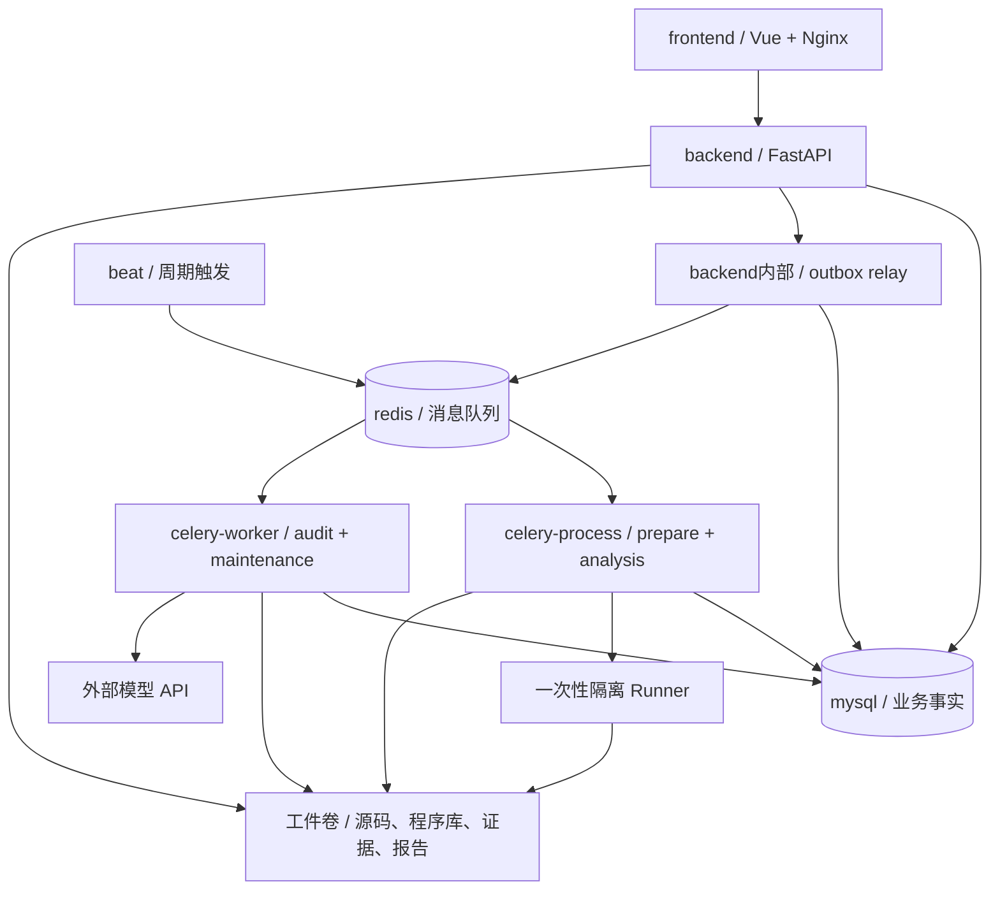

# 多容器部署、任务与数据存储设计

更新：2026-09-28。状态：重建目标设计，应用尚未实施。部署基线为七个常驻容器。

部署文件已写入 [deploy/compose.yaml](../deploy/compose.yaml)，挂载与启动前置条件见 [部署说明](../deploy/README.md)。目前仅通过配置验证，应用入口与 Runner 待实现。

## 1. 技术栈与职责

采用同仓模块化后端、多容器部署：Vue + FastAPI + Celery Worker + Celery Beat + Redis + MySQL。
八个业务模块仍然有效，不按八模块拆八个服务，不按每个漏洞或 Agent 创建常驻容器。

| 部件 | 负责 | 不负责 |
|---|---|---|
| Vue 前端 | 资产管理、扫描选择、Case/报告与状态展示 | 直接连数据库、模型或分析工具 |
| FastAPI | 身份/项目权限、用例、版本校验、API、事务受理 | 在 HTTP 请求内构建或执行长审计 |
| Celery Worker | 消费队列，执行准备、分析、调查、复核和报告任务 | 决定用户未授权的扫描范围 |
| Celery Beat | 按时间投递维护任务 | 实际执行任务、承担审计业务状态机 |
| Redis | Celery 消息 broker；可选短期执行结果 | 保存唯一审计记录或充当业务数据库 |
| MySQL | 项目、快照元数据、业务任务、Case、证据索引、裁决、报告索引与审计记录 | 保存整个代码仓、CodeQL 大型数据库文件 |
| 工件存储 | 固定源码快照、工具原始输出、程序库、日志与报告文件 | 决定任务状态和漏洞结论 |
| 程序分析适配器 | CodeQL 等建库/查询、Semgrep 等候选提取 | 替代 MySQL 或独立审计结论 |
| 检索适配器 | Sourcebot 等跨仓搜索、导航和上下文检索 | 证明精确数据流路径 |

Celery 是任务执行体系，Beat 是其中的周期调度组件；Beat 投递、Worker 执行，不要反过来理解。[Celery 官方说明](https://docs.celeryq.dev/en/stable/userguide/periodic-tasks.html)

## 2. 七容器组织方案（本轮收敛）

“celery-process”是本项目的部署名称，不是 Celery 自带的第二种服务；它和“celery-worker”都运行 Celery Worker，只是任务路由、依赖和资源不同。若原方案的 process 指 producer，生产者实际已包含在 API/Beat 的投递职责中，不需要再造一套任务服务。[Celery 任务路由](https://docs.celeryq.dev/en/stable/userguide/routing.html)

| 容器名 | 进程/职责 | 队列与关键边界 |
|---|---|---|
| frontend | Nginx 托管 Vue 构建产物、反向代理 API | 唯一 Web 入口，无数据库凭据 |
| backend | FastAPI + 生命周期管理的轻量 outbox relay | MySQL 事务受理、查询与可靠投递；不执行长审计 |
| celery-process | 准备/工具类 Celery Worker | `prepare`：固定代码、协调隔离构建/建库、资产提取；`analysis`：工具查询 |
| celery-worker | 审计类 Celery Worker | `audit`：调查/复核/报告；`maintenance`：调度检查与对账 |
| beat | 单活 Celery Beat | 周期发送 tick/维护任务，不执行构建或模型调用 |
| redis | Celery broker | 队列传输，短期结果可选；不是审计事实源 |
| mysql | 业务数据服务 | 项目、资产版本、任务/步骤、计划、Case、裁决、报告索引与定时策略 |

首版采用 Docker Compose；七个常驻容器描述 AIxSecurity Core，不代表启用全部分析能力后的总服务数。Sourcebot、对象存储、监控以及按任务创建的 Runner 属于 Tool/Execution Services，可通过独立部署或 Compose profile 启用。
API、两个 Worker、Beat 共享同一后端业务包，任务入口只装配并调用应用用例，不各自复制规则。工具镜像与资源限额可单独配置。

API 内 relay 是短时、有界的投递循环，由应用生命周期管理而非某次 HTTP 请求的临时回调；数据库锁/租约协调多实例，异常进入健康状态并重启恢复。API 全部停止时既有 Worker 继续当前工作，后续 outbox 步骤暂停投递，API 恢复后继续；这是七容器方案的明确取舍，不宣称全链路完全不依赖 API 存活。
未来若要求 API 停机也持续推进全部任务，再把 relay 独立为 dispatcher 容器，不改变业务接口。

两个队列不保证各有专用执行槽位：prepare 与 analysis、audit 与 maintenance 各自共享其 Worker 资源。长步骤必须有限时/检查点，预取受控，维护延迟可观察；不能只调优先级就宣称维护任务绝不饿死。达到维护时延或交互查询瓶颈后，再加独立 control/query Worker，而不是本轮先堆容器。
调查和复核使用独立上下文与任务；不同容器不代表模型错误统计独立。Agent Runtime 不直接等于 celery-worker 进程，生产实现可由 Worker 编排隔离 Agent Session Runner。

只暴露 frontend 入口；API、MySQL、Redis 留在内部网络。前端代理 `/api/v1`；健康检查和启动重试区分“容器已启动”与“依赖可用”。
MySQL、Redis、Beat 状态和工件各有持久卷与恢复策略。首版工件卷只适用于单机部署；多主机改用共享/对象存储端口后再扩展。

### 2.1 后端代码怎样组织（目标目录，未创建）

- `domain/`：快照、计划、Case、证据、裁决与版本规则。
- `application/`：资产准备、审计编排、查询、定时策略、报告用例。
- `adapters/`：MySQL、Redis/Celery、模型、程序分析、工件与 Runner 适配。
- `entrypoints/api/`：FastAPI 接口；`entrypoints/tasks/`：两类 Worker 的薄任务入口。
- `entrypoints/beat/`：周期 tick 配置；`entrypoints/relay/`：可靠消息投递循环，首版由 backend 管理。
- `composition/`：按容器角色装配依赖；任务消息只传 ID/版本，不把数据库连接或整仓代码当参数。

## 2.2 三条业务流程串联

**流程 A：纳入和自动准备。** Vue 登记仓库 → API 在 MySQL 创建项目、准备任务与 outbox → relay 投递 Redis → celery-process 固定 commit、通过 Runner 构建/提取 → 工件卷写产物 → MySQL 发布能力与质量合格的 READY 快照 → 前端查询展示。结束时不自动发起审计。

**流程 B：人工审计。** Vue 选择 READY 版本、专项/方法、范围、预算 → API 固定 ScanSpec 并创建运行/outbox → celery-worker 开始调查 → 需要工具路径时异步生成 analysis 子任务交给 celery-process → 程序结果写工件和证据引用 → 应用编排器推进调查、独立复核、报告 → MySQL 写版本绑定的结果，前端展示和下载。
Worker 不阻塞等待另一个 Celery task 的同步结果；依靠持久步骤状态/outbox 推进，避免池耗尽造成互相等待。

**流程 C：定时自动化。** 用户配置并启用 schedule → MySQL 保存版本化策略 → Beat 周期 tick → maintenance 任务查到期策略 → 校验启用状态、权限、预算与必要资产 → 事务创建 occurrence + 业务任务 + outbox → 进入 A 或 B。同一周期只产生一份业务运行；消息重投不会增加一份审计。

## 3. 五类数据不能混为一个“数据库”

### 3.1 MySQL：业务事实与表结构草案

采用事务表、schema 版本迁移和外键/唯一约束；具体 DDL 在契约阶段设计，本轮不写 SQL。

| 表组（逻辑名） | 保存内容 |
|---|---|
| projects / repositories / repo_revisions | 项目、仓库、固定 commit、服务与模块身份 |
| preparation_jobs / job_steps / task_attempts | 准备/执行步骤、尝试、租约、输入摘要与错误 |
| asset_snapshots / snapshot_members / capabilities | 不可变快照、集合成员、质量与能力清单 |
| assets / asset_relations | Entry/Source/Sink/Guard、符号/位置、来源、精度与关系引用 |
| profiles / plans / scan_specs / scan_runs | 版本化专项与计划、人工选择、固定范围和预算、运行 |
| cases / case_revisions / evidence_refs | 分支、支持/反证、证据摘要、来源和工件引用 |
| verdicts / findings / reports | 有效裁决、问题、报告版本/覆盖摘要、文件引用 |
| schedules / schedule_revisions / schedule_occurrences | 定时策略、版本、周期实例与去重 |
| audit_events / idempotency_keys / outbox_events | 操作轨迹、幂等请求、待可靠投递的事件 |

MySQL 保存可查询的结构化结论与引用，大型证据正文/程序库存在工件存储。UI 表格通过 API 查询 MySQL；不能只从 Markdown 报告重新解析列表。
Case 是调查对象，Finding 是报告问题，Verdict 是版本绑定结论，三者不合并为一个漏洞表。
用户/权限关系在接口权限设计时补充；数据库管理员凭据不分发给所有组件，按组件职责赋权。

### 3.2 固定源码与工件：文件/对象存储

建议逻辑键：`repos/{repo_id}/{commit}`、`snapshots/{snapshot_id}/manifest`、`attempts/{attempt_id}`、`reports/{report_id}`。
源码保留版本、文件摘要和路径映射；活跃 Git 镜像可更新，已发布源码快照不可覆盖。
产物索引记录 artifact_id、SHA256、大小、类型、版本、来源、存储键和访问范围。数据库只存逻辑键，下载接口按资源权限解析，不接受任意主机文件路径。
构建临时区与发布区分开；数据库备份必须对应工件 manifest，不然恢复后只剩一堆失效链接。
清理使用引用检查和保留期，扫描/报告正在引用的源码、程序库或证据不能删除。

### 3.3 CodeQL：程序分析数据库

CodeQL 从代码生成用于查询的程序数据库，执行查询后解释结果；它不是 MySQL 中的一组审计业务表。[CodeQL 官方概述](https://codeql.github.com/docs/codeql-overview/about-codeql/)

以 repo revision + 工具/查询包版本 + 构建配置摘要关联程序库工件。通过 Query Service 选择匹配版本建库/查询，保留查询参数、路径与精度。
默认设计为工具 Runner 内按需运行 CLI，产物在工件卷，不为名称带“数据库”就部署一个常驻 CodeQL 数据库服务器。
CodeQL 为优先验证候选，不标为已接入；接入前验证 Java/Maven/Gradle 适配、资源消耗、版本和使用/分发条件。
Semgrep 保留为规则/候选适配器，不冒充 CodeQL 的精确程序路径。必要分析能力缺失时，计划明确不可用，不静默替换成低精度扫描。

### 3.4 Sourcebot：代码搜索与导航

之前提到的另一项是 **Sourcebot**，用于帮助人和 Agent 搜索和理解代码，不是审计结果数据库。[官方仓库](https://github.com/sourcebot-dev/sourcebot)

定义 CodeSearchPort / CodeNavigationPort，Sourcebot 作为首选快速检索与导航实现；固定快照本地检索保留为回退。Sourcebot 可独立部署或通过 Compose profile 启用；接入前必须验证固定 commit、权限、索引一致性和性能，不计入 AIxSecurity Core 七容器。
索引可重建；搜索结果必须校验快照/源码哈希。关系搜索只提供调查线索，不等于精确污点路径。
向量库和专用图数据库暂不加入；统一资产关系先用 MySQL 关系表，不影响未来更换查询适配器。

### 3.5 Redis：消息，不是审计账本

队列只携带 job_id、任务种类、schema/version 等小消息，不传源码全文、密钥或报告。
Celery result backend 可用 Redis 保存短期诊断，但业务 API 的状态来自 MySQL；不依赖 result backend 拼回整条审计历史。
Redis 设置持久化、内存容量和禁止随意淘汰队列键的策略；消息恢复仍依赖业务去重与协调，不声称永不丢失。
Redis broker 存在 visibility timeout 与重投递语义，长任务必须结合确认策略、步骤时间上限和恢复实验配置，不能只把超时无限调大。[Celery Redis 文档](https://docs.celeryq.dev/en/stable/getting-started/backends-and-brokers/redis.html)
缓存若以后需要，与 broker 分开资源策略；首版不把大量检索缓存塞进消息实例。

## 4. 谁负责调度，怎样避免双写丢任务

1. FastAPI 校验人工请求，在同一 MySQL 事务内写业务任务与 outbox event，提交后返回受理状态。
2. backend 内 relay 读取未投递事件发往 Redis，成功后标记投递；发送后崩溃可能重复，因此不承诺 exactly-once。
3. Worker 从 MySQL 读取可信任务数据，按业务幂等键、状态、attempt/token 领取。重复消息不重复发布快照/报告。
4. Worker 分步骤执行并记录检查点、心跳、预算与产物；提交必须校验有效 attempt 与版本。
5. 下一步的就绪条件由应用编排器判断，与状态一起写 outbox；Celery 负责运输和执行，不成为唯一业务状态机。
6. 协调任务检查长期未开始、租约过期和投递异常，有限重投；不得与仍有效的执行器同时发布。

取消先写 MySQL 请求状态，Worker 停止新工作并终止所属工具子进程，确认后进入终态；单靠 Celery revoke 不足以证明运行中的构建已经停止。
MySQL 或 Redis 不可用时显示受理/投递/执行阶段与错误，不把队列中断记为“没有漏洞”。
首阶段不用 chord/result backend 作为审计结果唯一来源；不允许多个调度体系竞争消费同一业务任务。

## 5. 定时自动化能力保留，不破坏人工控制

| 定时功能 | 默认行为 | 产物 |
|---|---|---|
| 仓库更新检查 | 用户启用后检查远端版本；无变化不重复构建 | 检查记录、新 RepoRevision |
| 构建与资产刷新 | 对新版本按指定 PreparationProfile 准备 | 新快照或失败诊断，旧 READY 保留 |
| 定时审计 | 仅对用户显式启用的审计策略运行 | 固定 ScanSpec、ScanRun、Case 与报告 |
| 恢复与工件清理 | 系统维护，遵守租约和引用保留策略 | 对账/恢复记录、清理审计事件 |

因此“人选计划”可以是当次点击，也可以是先批准版本化的周期审计策略；不是每次 tick 都要求点一次，也不是登记仓库就默认开扫。
定时拉仓和定时审计独立开关；需要“刷新成功后审计”时保存显式依赖，准备失败则该周期阻塞/跳过并记录，不能默默改扫旧版本。

MySQL 增加 `schedules`、`schedule_revisions`、`schedule_occurrences`：包含类型、项目/仓库范围、cron/时区、启停、创建人/授权、准备配置或 Plan/Profile、预算、快照选择、重叠与漏跑策略。
Beat 首版只保留固定 tick 与维护触发配置，不为每个用户规则同步维护另一份独立调度真相。maintenance 读取 MySQL 策略；用户时区计算到期时间，存储 UTC 时间戳。

快照策略明确选 `pinned`、`latest_ready_at_trigger` 或 `refresh_then_scan`；前者固定既有快照，后两者在实际创建 ScanSpec 时解析并冻结版本。运行中永不再读取 latest；策略等待条件、延迟或不满足都留记录。
同一项目/策略运行重叠首版默认 skip 并记录原因；漏跑默认合并一次、不无限补齐。幂等唯一键包含 schedule_id、schedule_revision、scheduled_for；策略变更、暂停或权限撤销在创建运行时再次验证。
预算按周期与日累计限制，模型/工具失败不无限重试。暂停只停止新增周期；取消已经运行的任务走独立取消流程。

同一套 Beat 调度只运行一个活跃实例；周期任务可能重叠，需要业务互斥/幂等处理。[官方周期任务说明](https://docs.celeryq.dev/en/stable/userguide/periodic-tasks.html)
MySQL 策略与 occurrence 支持维护任务延迟后重新检查到期窗口；延迟不伪装准点执行。首版不引入 Django 管理定时任务。

## 6. 三类隔离执行边界

### 6.1 Build Runner

celery-process 负责协调，第三方 Maven/Gradle、CodeQL 建库和项目相关提取在一次性 Build Runner 中执行。目标仓脚本属于不可信输入。

Build Runner：
- 只获得固定源码、临时目录和必要依赖网络；
- 无 MySQL/Redis/模型长期凭据；
- 不挂宿主 Docker socket；
- CPU/内存/时间/网络受限；
- 输出只允许约定工件。

### 6.2 Agent Runner

Claude Code、Codex 等 Agent 可以由 celery-worker 编排到隔离 Agent Session Runner。Agent Runner：
- 读取受控 Workspace 或只读源码快照；
- 通过 Tool Gateway 获取 Sourcebot / CodeQL / Asset Graph 能力；
- 可以具有模型访问能力，但不直接连接业务数据库；
- 默认不执行目标项目构建脚本；
- 不拥有扩展 ScanSpec Scope 的权限；
- 会话、工具调用和结构化写回可追溯。

### 6.3 Validation Runner

运行时/黑盒验证只有在 VerificationPolicy 显式允许时创建 Validation Runner：
- 独立目标白名单；
- 网络与速率限制；
- 非破坏 payload 策略；
- 最小凭据；
- 完整输入/输出和环境记录；
- 可立即取消。

Build Runner、Agent Runner、Validation Runner 不共享默认权限。动态验证失败或环境不可用只能形成 Gap / needs_external_fact，不能记为 rejected。

API、普通 Worker 和 Runner 均不挂无限宿主权限。源码索引/建库也按不可信输入处理；发送给模型的代码和证据必须经过范围与秘密过滤。

## 7. 上线前的必测故障

- MySQL 提交成功但 Redis 发布失败：outbox 可恢复；重复发送不重复执行副作用。
- Worker 领取后崩溃、网络分区、超时重投：旧 attempt 不能发布，检查点可追溯。
- Beat 重启/任务重叠：不重复清理、不自动扫描，不清理被引用工件。
- Redis 重启/数据恢复：业务状态仍在 MySQL；未完成任务可协调恢复。
- MySQL 与工件恢复：快照、源码、CodeQL库、证据和报告引用全部可定位且哈希一致。
- 准备任务拥塞：API 读取不被构建阻塞；维护排队时延有记录；超出约定时延才增加专用 Worker，模型并发受配额控制。
- Runner 中的项目脚本访问凭据/宿主路径：隔离验证拒绝越界，失败可观察。

这些是后续实现门禁，本轮没有运行容器、建 MySQL 表或完成 CodeQL 集成。
