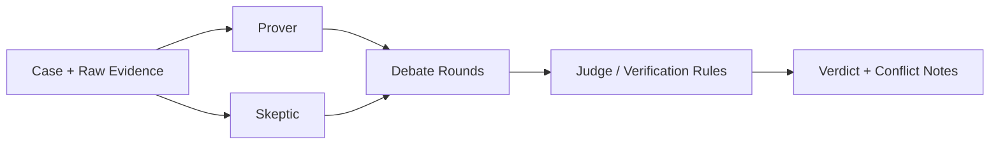

# 漏洞可信验证与证据等级

状态：目标设计。本文定义 M7 的多级验证体系。验证策略由 Scan Plan / Profile / Case 风险决定，不要求所有问题都执行最高成本验证。

## 1. 为什么验证是独立阶段

AI / 静态分析可能产生：
- 不可达路径；
- 错误的可控性判断；
- 忽略框架默认保护；
- 错误的鉴权语义；
- 误解配置；
- 幻觉代码关系；
- 仅理论成立但环境不成立的问题。

因此：

```text
Candidate != Finding
Agent says yes != Confirmed
CodeQL path != Exploitable
```

所有正式 Finding 都必须携带 Verification Record 和 Evidence Level。

## 2. Verification Policy

ScanSpec / Profile 可以选择：

```text
static_review
independent_agent
agent_debate
runtime_validation
blackbox_validation
human_review
```

可以组合，并定义什么时候升级。

例如：
- 普通中低风险：静态独立复核；
- 高危、证据冲突：双 Agent 互辩；
- 可安全启动的测试环境：运行时 / 黑盒验证；
- 生产相关或高风险动作：要求人工批准，不自动执行。

## 3. Level 0：候选

来源：
- 规则命中；
- Sourcebot 搜索；
- AST 模式；
- Sink-first / Source-first 线索；
- Agent 提出。

状态只能是 Candidate / Case，不能作为 confirmed Finding。

## 4. Level 1：程序与静态证据复核

Verifier 使用：
- 固定 commit；
- 原始代码；
- CodeQL / 数据流 / 调用路径；
- Asset / Guard；
- 支持与反证；
- Profile Verification Rules。

重新检查：
- reachability；
- controllability；
- sanitizer；
- guard；
- 框架语义；
- 成立前提；
- evidence completeness。

调查 Agent 的总结可以作为输入索引，但不能代替原始证据。

## 5. Level 2：独立 Agent

独立 Agent：
- 使用新的上下文；
- 不继承 Investigator 的自由文本结论；
- 获取 Case、Goal、Profile、原始证据和必要代码；
- 主动寻找反证；
- 输出独立意见。

可采用同一模型的独立会话，也可以配置不同模型。若使用同一模型，只能声称上下文独立，不能宣称统计独立。

## 6. Level 3：双 Agent 互辩

适用于：
- 高危漏洞；
- Investigator 与 Verifier 意见冲突；
- 业务逻辑 / 鉴权等强语义问题；
- 需要解释多个合理假设的 Case。

角色可以是：

```text
Prover Agent
目标：在证据范围内证明漏洞成立。

Skeptic Agent
目标：寻找使漏洞不成立的反证、Guard、不可达条件和环境前提。
```

流程：



关键约束：
- 双方必须引用 Evidence Ref；
- 不能凭空提出未读取代码事实；
- 轮数受预算限制；
- 新证据必须通过 Tool Gateway 获取；
- Judge 不能因为“多数 Agent 同意”直接判定成立；
- 若核心前提仍未知，输出 suspicious / needs_external_fact。

## 7. Level 4：运行时验证

在有安全、可控、可复现环境时，可以执行：
- 单元/集成级验证；
- JVM 测试 Harness；
- 局部方法或组件级验证；
- 沙箱执行；
- 请求重放；
- Trace / instrumentation。

原则：
- 默认不修改目标仓；
- 可在派生工作区生成临时 Harness；
- 构建和执行进入隔离 Runner；
- 输出环境、命令、输入、日志、返回值和哈希；
- 不把“测试 Harness 成功”自动等同生产环境可利用。

## 8. Level 5：黑盒验证

当已有授权测试环境或可安全启动目标时，可进行：
- HTTP / RPC 请求验证；
- 参数边界测试；
- 权限对比请求；
- SSRF / SQLi / Path 等安全验证；
- 必要的动态 Trace。

必须遵循：
- 明确目标环境和授权；
- 明确请求预算和速率；
- 禁止破坏性 payload；
- 不对未授权外部目标发起测试；
- 记录输入、响应、环境版本和验证时间。

黑盒结果和静态代码证据相互补充：
- 静态证据解释“为什么可能存在”；
- 黑盒证据证明“在该环境和条件下实际可触发”。

## 9. Verdict

建议：

```text
confirmed
suspicious
rejected
needs_external_fact
unreviewed
```

其中：
- confirmed：在明确 Evidence Level 和前提下成立；
- suspicious：有较强线索但仍缺关键证明；
- rejected：存在充分反证；
- needs_external_fact：必须依赖部署、身份、配置、数据或运行态事实；
- unreviewed：尚未进入有效验证，不是 rejected。

## 10. Evidence Level

报告中建议标注：

```text
E0  Candidate only
E1  Static/program evidence reviewed
E2  Independent agent verified
E3  Adversarial multi-agent debate verified
E4  Runtime/sandbox validated
E5  Authorized black-box validated
```

Evidence Level 表示验证方式，不等于漏洞严重度。

## 11. 验证升级策略

示例：

```text
Case
 ↓
Static Review
 ↓
证据充分且低争议? ── yes → Verdict
 ↓ no
Independent Agent
 ↓
仍冲突且高风险? ── yes → Agent Debate
 ↓
可安全运行验证? ── yes → Runtime / Blackbox
 ↓
Verdict / Gap
```

Plan 可定义：
- max_verification_level；
- auto_escalation_rules；
- require_human_approval_for_dynamic；
- debate_round_budget；
- runtime_budget；
- allowed_targets。

## 12. 安全边界

动态/黑盒验证必须比静态调查拥有更严格的权限：
- 默认关闭；
- 必须显式启用；
- 目标白名单；
- 非破坏模式；
- 独立 Runner / 网络策略；
- 凭据最小化；
- 完整审计日志；
- 能立即取消；
- 失败不能转成 rejected。

最终系统追求的不是“尽可能自动打漏洞”，而是 **在授权和安全边界内，用更强证据降低 AI 白盒审计误报与错误结论。**
