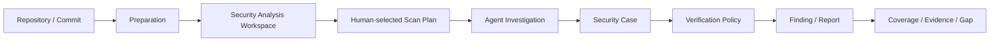

# AIxSecurity 愿景、设计来源与核心原则

状态：目标设计基线。本文用于约束后续架构与实现，不代表全部能力已经落地。

## 1. 系统定位

AIxSecurity 是面向企业 Java / 微服务代码仓的 AI 辅助白盒安全审计平台。

它不是“把整个仓库直接交给大模型自由找漏洞”，而是先把代码转换为一个可复用、可查询、可验证的 **Security Analysis Workspace**，再由人工选择扫描计划，交给 Claude Code、Codex 或其他 Coding Agent，在明确的 Scope、Profile、Skill、Goal、Budget 和 Tool Policy 下调查问题。

最终产物不是一句“AI 认为有漏洞”，而是：

```text
Finding
+ 固定代码版本
+ 可回放程序事实
+ 支持证据
+ 反证
+ 分析轨迹
+ 验证方式
+ 证据等级
+ Coverage / Gap
```

系统目标可以概括为：

> **白盒安全分析工作台 + Agent 调查系统 + 可信验证系统。**

## 2. 设计来源

### 2.1 SAIL：工程化资产准备

继承的核心能力：
- 拉取和固定代码版本；
- JDK / Maven / Gradle / 框架识别；
- 隔离构建与 CodeQL 数据库准备；
- API / Entry / 程序资产提取；
- 异步任务、状态、结果和工件落库；
- Java 微服务优先；
- 不侵入目标生产业务环境。

SAIL 主要解决：**如何稳定地把代码准备成可分析资产。**

### 2.2 AI4PA：All Code is a Graph

继承的核心方法：
- 程序分析擅长确定性结构与路径；
- LLM 擅长业务、安全和框架语义；
- 二者互补，而不是互相替代；
- Agent 不直接通读百万行代码，而是在 AST / Call Graph / Data Flow / Security Relations 等结构上搜索；
- 跨模块、跨仓、跨服务问题通过图和关系逐步扩展上下文。

AI4PA 主要解决：**Agent 如何在大规模代码上维持注意力、覆盖和可解释性。**

### 2.3 Chimera：人选模式、多 Agent 分工与验证

继承的核心方法：
- 扫描模式、专项、范围和预算由人选择，不让 Agent 自行扩扫；
- 广扫、专项、深扫可以拥有不同预算与执行策略；
- Agent 可分工调查、补证、反证、复核；
- 高价值或争议 Case 可以进入双 Agent 互辩；
- 第一位 Agent 的单次输出不能直接升级为最终 Finding。

Chimera 主要解决：**多 Agent 如何在受控策略下协作，而不是自由漫游。**

### 2.4 Sourcebot：前置代码智能与快速检索

继承的核心能力：
- 多仓索引；
- 快速文本/正则搜索；
- Definition / Reference 导航；
- 固定 ref 读取源码；
- commit / diff 上下文；
- 让 Agent 把时间花在分析问题，而不是反复 grep 全仓。

Sourcebot 主要解决：**如何快速、低成本地取得精确代码上下文。**

## 3. 核心原则

1. **Asset First**：先准备代码、程序和安全资产，再开始安全调查。
2. **Human-selected Plan**：扫描计划、专项、范围、预算由人或显式授权策略决定。
3. **Agent 不扩权**：Agent 可以决定下一步调查动作，不能扩大 ScanSpec 的授权范围。
4. **Source-Driven but not Source-only**：Source-first 是重要方法，但 Sink-first、Entry/Guard、Asset Root、规则、图和变更驱动同样存在。
5. **程序事实与模型推断分离**：工具结果是事实/线索，Agent 输出是推断。
6. **Code Search != Program Proof**：Sourcebot 搜索不是数据流证明。
7. **Program Analysis != Security Verdict**：CodeQL 路径不是最终漏洞结论。
8. **Profile != Prompt**：漏洞专项是版本化专业分析模型，不是一段自然语言提示词。
9. **Skill != Goal**：Skill 是可复用专业能力，Goal 是一次具体调查目标。
10. **Case before Finding**：候选必须先进入 Security Case，再调查和验证。
11. **Evidence First**：结论必须追溯到固定版本、代码位置、工具结果和分析轨迹。
12. **Counter-evidence First-class**：反证与支持证据同等重要。
13. **Independent Verification**：调查者不能直接成为最终裁决者。
14. **Coverage is a Product Capability**：必须回答扫了什么、没扫什么、为什么没扫。
15. **Replaceable Tools**：Sourcebot、CodeQL、Semgrep、Agent Runtime 都通过端口接入，不绑死领域模型。
16. **No silent downgrade**：能力缺失、版本不匹配、预算耗尽、工具失败必须显式形成 Gap。

## 4. 核心闭环



Preparation 不等于扫描；READY 后默认停止。只有人工或已授权周期策略创建 ScanSpec 后才进入安全调查。

## 5. Security Analysis Workspace

一个 READY 快照可以提供：

```text
Fixed Source
File Manifest / Hash
Build Context
Dependencies
Framework Facts
Sourcebot Search Index
Symbols / Definitions / References
Entry / Source / Sink / Guard
API / RPC / MQ / Job / Data Assets
Call / Relation Graph
CodeQL DB
Data-flow / Path Query Capability
Config / Deployment Context
Tool Versions
Capability Matrix
Quality / Gap
```

Workspace 是 Agent 的安全分析工作台，不是把所有数据一次性塞入上下文。Agent 通过 Tool Gateway 按 Goal 拉取有限、可溯源的信息。

## 6. 从“扫描器”到“调查系统”

传统扫描器通常是：

```text
Rule -> Match -> Finding
```

AIxSecurity 的主链路是：

```text
Asset / Program Facts
        ↓
Candidate / Trigger
        ↓
Security Case
        ↓
Agent Investigation
        ↓
Supporting Evidence + Counter Evidence + Gaps
        ↓
Independent Verification
        ↓
Verdict
        ↓
Finding / Report
```

因此系统优化目标不是“让模型更敢报”，而是：
- 更完整地发现候选；
- 更快地取得上下文；
- 更好地证明路径；
- 更主动寻找反证；
- 更严格地区分已证实、可疑、未知和排除。

## 7. 最终愿景

AIxSecurity 最终应能够对一个或多个企业代码仓回答：

- 系统里有什么安全相关资产？
- 哪些 Entry、Source、Sink、Guard 和关键数据资产存在？
- 不同仓、模块、服务之间是什么关系？
- 对某个漏洞专项，采用了哪些分析方法？
- 每个候选问题为什么成立或为什么被排除？
- 证据来自哪个 commit、工具、路径、代码位置？
- 哪些结论经过独立 Agent、互辩或运行时验证？
- 当前还有哪些框架、路径、仓库、Sink 或远端边没有覆盖？
- “测完”究竟指哪个明确分母上的完成状态？

只有同时回答这些问题，才算完成一次可审计、可解释、可复核的白盒安全分析。
